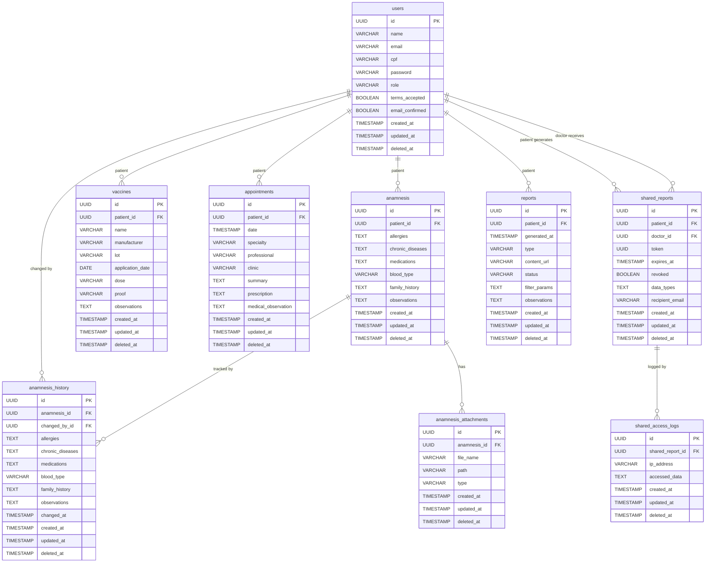

```mermaid
erDiagram
    users {
        UUID id PK
        VARCHAR name
        VARCHAR email
        VARCHAR cpf
        VARCHAR password
        VARCHAR role
        BOOLEAN terms_accepted
        BOOLEAN email_confirmed
        TIMESTAMP created_at
        TIMESTAMP updated_at
        TIMESTAMP deleted_at
    }

    anamnesis {
        UUID id PK
        UUID patient_id FK
        TEXT allergies
        TEXT chronic_diseases
        TEXT medications
        VARCHAR blood_type
        TEXT family_history
        TEXT observations
        TIMESTAMP created_at
        TIMESTAMP updated_at
        TIMESTAMP deleted_at
    }

    anamnesis_history {
        UUID id PK
        UUID anamnesis_id FK
        UUID changed_by_id FK
        TEXT allergies
        TEXT chronic_diseases
        TEXT medications
        VARCHAR blood_type
        TEXT family_history
        TEXT observations
        TIMESTAMP changed_at
        TIMESTAMP created_at
        TIMESTAMP updated_at
        TIMESTAMP deleted_at
    }

    anamnesis_attachments {
        UUID id PK
        UUID anamnesis_id FK
        VARCHAR file_name
        VARCHAR path
        VARCHAR type
        TIMESTAMP created_at
        TIMESTAMP updated_at
        TIMESTAMP deleted_at
    }

    vaccines {
        UUID id PK
        UUID patient_id FK
        VARCHAR name
        VARCHAR manufacturer
        VARCHAR lot
        DATE application_date
        VARCHAR dose
        VARCHAR proof
        TEXT observations
        TIMESTAMP created_at
        TIMESTAMP updated_at
        TIMESTAMP deleted_at
    }

    appointments {
        UUID id PK
        UUID patient_id FK
        TIMESTAMP date
        VARCHAR specialty
        VARCHAR professional
        VARCHAR clinic
        TEXT summary
        TEXT prescription
        TEXT medical_observation
        TIMESTAMP created_at
        TIMESTAMP updated_at
        TIMESTAMP deleted_at
    }

    shared_reports {
        UUID id PK
        UUID patient_id FK
        UUID doctor_id FK
        UUID token
        TIMESTAMP expires_at
        BOOLEAN revoked
        TEXT data_types
        VARCHAR recipient_email
        TIMESTAMP created_at
        TIMESTAMP updated_at
        TIMESTAMP deleted_at
    }

    shared_access_logs {
        UUID id PK
        UUID shared_report_id FK
        VARCHAR ip_address
        TEXT accessed_data
        TIMESTAMP created_at
        TIMESTAMP updated_at
        TIMESTAMP deleted_at
    }

    reports {
        UUID id PK
        UUID patient_id FK
        TIMESTAMP generated_at
        VARCHAR type
        VARCHAR content_url
        VARCHAR status
        TEXT filter_params
        TEXT observations
        TIMESTAMP created_at
        TIMESTAMP updated_at
        TIMESTAMP deleted_at
    }

    users ||--o{ anamnesis : "patient"
    users ||--o{ vaccines : "patient"
    users ||--o{ appointments : "patient"
    users ||--o{ shared_reports : "patient generates"
    users ||--o{ shared_reports : "doctor receives"
    users ||--o{ anamnesis_history : "changed by"
    users ||--o{ reports : "patient"
    anamnesis ||--o{ anamnesis_history : "tracked by"
    anamnesis ||--o{ anamnesis_attachments : "has"
    shared_reports ||--o{ shared_access_logs : "logged by"
```
